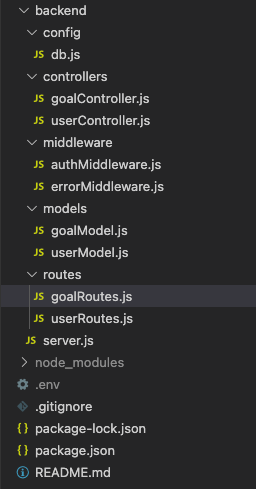

# Mern-Stack Goal Tracker

A MERN stack tutorial by Traversy Media where we will create a RESTful API from scratch with Node.js, Express, MongoDB and Mongoose. In this web application the user will be able to register, log in, create, read, update and delete goals.

## How to use:

Step 1:

```
cd backend
npm install
npm run server
```

Step 2:

```
cd ..
cd frontend
npm install
npm run start
```

## How RestAPI works:


_source:_(https://networkop.co.uk/blog/2016/01/01/rest-for-neteng/)

In the picture above the are using devices in the url, where as ours will be goals.

The operations we want to do in this instance are called **CRUD (CREATE, READ, UPDATE, DELETE)**.

Our **client** will be our React Application which is where all of our UI, all of our components and our state with Redux go.

Our **server** we're going to build with express which is a node.js backend framework and this will be our API

We need these two to communicate, we do that with a restAPI, which includes a bunch of http requests.

**Create:** (HTTP POST /api/goal/payload)
To create a goal you would make a HTTP POST request (POST IS THE METHOD). You alos send a payload of data, because if you are creating something you are going to send some data with it to the HTTP body. That then gets back a 201 status code from the server, which means everything went ok and something was created.

**Read:** (HTTP GET /api/goal/payload)
To read a goal we would make a HTTP GET request. End point is the same as the create but has diffetent methods. Then you just back a 200 status which means everything is ok.

**Update:** (HTTP PUT /api/goal/1 +payload)
To update a goal we would use a PUT request, pretty similar to the create and read but this time you would include the ID in the actual endpoint URL because you need to know which goal is being updated. Also get a 200 status ok back.

**Delete:** (HTTP DELETE /api/goal/1)
To delete a goal is same thing as update however you make a delete request to the URL with the id of the goal. Also get a 200 status ok back.

## MongoDB:

A document-oriented database programme based on NoSQL.

## Express:

It’s a robust Node.js web application framework that helps in creating powerful REST APIs.

## React:

A JavaScript library used to create beautiful and interactive user interfaces developed by Facebook and the community of individual developers.

## Node:

It’s a JavaScript runtime environment built on Google Chrome’s V8 engine, and it compiles js at the runtime.

## Backend/Server:

**Backend File Structure:**



The backend consists of:

- server.js
  - Here we set up basic configuration such as database connection with Mongo server, route configuration, express configuration and other required setup.
- routes
  - Here each resource in our API will have a routes file.
- models
  - Here we define any resources we have, in this case we have a users and goals, each of those have a schema where we put what fields we want users and goals to have.
- middleware
  - Middleware is functions that execute during the request response, in this case we tell it to throw a error message instead of the defualt express error message.
- controller
  - Here we create the functions for each HTTP CRUD route.
- config/db.js

  - We use this file to connect to MongoDB and we'll use mongoose to help with that.

## Authentication:

Resgister end point and Log in end point. Once we autheticate we will be able to get a json web token, we can use that token to access protective routes.

**JWT (JSON Web Tokens)**
We get a encoded token with three different parts. The first part is the header which includes the algorithm and the token type. The second part is some data in json format, you can include whatever you want in here and in our case we are going to include the user ID, it also has a issued has a timestamp which the token was issued at. The third part is a a signature which ensures the JWT hasn't been altered or tampered with in any way. This helps us when we have a route we it protects it for us, we want the user to be able to log in, which gets the token and then send the token in the headers to access that particular route.

_source:_(https://jwt.io)

## Frontend/Client:

Here we have a user interface with a register form, log in form and a dashboard where we have goals.

Tech used is: Redux & Redux tool kit.

### Other tools used:

> Postman: HTTP Client (Used to test the REST APIs)

> MongoDB Atlas: Cloud Database
